# AI Therapist Scoring Algorithm Mindmap

```mermaid
mindmap
  root((AI Therapist<br>Scoring Algorithm))
    1[Score<br>Categories]
      1.1[Risk Level]
        1.1.1(Self-harm Thoughts)
          1.1.1.1["Yes (+60)"]
          1.1.1.2["No (+0)"]
          1.1.1.3["Prefer not to say (+30)"]
        1.1.2(Crisis Help Need)
          1.1.2.1["Yes (+70)"]
          1.1.2.2["No (+0)"]
        1.1.3(Emotional State)
          1.1.3.1["≤3 (+20)"]
          1.1.3.2["4-5 (+10)"]
          1.1.3.3[">5 (+0)"]
        1.1.4(Feeling Down Frequency)
          1.1.4.1["Nearly every day (+20)"]
          1.1.4.2["More than half (+15)"]
          1.1.4.3["Several days (+5)"]
          1.1.4.4["Not at all (+0)"]
        1.1.5(Impact Assessment)
          1.1.5.1["≥15 total days (+15)"]
          1.1.5.2["10-14 total days (+10)"]
          1.1.5.3["5-9 total days (+5)"]
          1.1.5.4["<5 total days (+0)"]
      1.2[Depression Severity]
        1.2.1(Emotional State)
          1.2.1.1["≤3 (+30)"]
          1.2.1.2["4-5 (+20)"]
          1.2.1.3["6-7 (+10)"]
          1.2.1.4[">7 (+0)"]
        1.2.2(Sleep Quality)
          1.2.2.1["Poor (+15)"]
          1.2.2.2["Fair (+5)"]
          1.2.2.3["Good (+0)"]
        1.2.3(Appetite Changes)
          1.2.3.1["Decreased (+15)"]
          1.2.3.2["Increased (+10)"]
          1.2.3.3["Normal (+0)"]
        1.2.4(Feeling Down Frequency)
          1.2.4.1["Nearly every day (+40)"]
          1.2.4.2["More than half (+30)"]
          1.2.4.3["Several days (+15)"]
          1.2.4.4["Not at all (+0)"]
      1.3[Anxiety Severity]
        1.3.1(Stress Frequency)
          1.3.1.1["Always (+40)"]
          1.3.1.2["Often (+30)"]
          1.3.1.3["Sometimes (+20)"]
          1.3.1.4["Rarely (+5)"]
          1.3.1.5["Never (+0)"]
        1.3.2(Emotional State)
          1.3.2.1["≤5 (+15)"]
          1.3.2.2[">5 (+0)"]
      1.4[Lifestyle Impact]
        1.4.1(Productivity Days)
          1.4.1.1["Days affected (days/7 * 20)"]
        1.4.2(Work Days)
          1.4.2.1["Days missed (days/7 * 25)"]
        1.4.3(Relationship Days)
          1.4.3.1["Days affected (days/7 * 25)"]
        1.4.4(Total Impact Days)
          1.4.4.1["≥15 days (+40)"]
          1.4.4.2["10-14 days (+30)"]
          1.4.4.3["5-9 days (+20)"]
          1.4.4.4["<5 days (+10)"]
      1.5[Coping Capacity]
        1.5.1(Social Support)
          1.5.1.1["Yes (+20)"]
          1.5.1.2["Somewhat (+10)"]
          1.5.1.3["No (-20)"]
        1.5.2(Exercise Frequency)
          1.5.2.1["Regularly (+20)"]
          1.5.2.2["Occasionally (+10)"]
          1.5.2.3["Never (-10)"]
        1.5.3(Prior Therapy)
          1.5.3.1["Yes (+15)"]
          1.5.3.2["No (+0)"]
      1.6[Social Support]
        1.6.1(Social Support Check)
          1.6.1.1["Yes (+40)"]
          1.6.1.2["Somewhat (+20)"]
          1.6.1.3["No (-40)"]
        1.6.2(Relationship Status)
          1.6.2.1["Married (+15)"]
          1.6.2.2["In a relationship (+15)"]
          1.6.2.3["Single (+0)"]
          1.6.2.4["Divorced (-10)"]
          1.6.2.5["Widowed (-10)"]
      1.7[Treatment Readiness]
        1.7.1(Prior Therapy)
          1.7.1.1["Yes (+20)"]
          1.7.1.2["No (+0)"]
        1.7.2(Current Medication)
          1.7.2.1["Yes (+15)"]
          1.7.2.2["No (+0)"]
        1.7.3(Past Diagnosis)
          1.7.3.1["Has diagnosis (+25)"]
          1.7.3.2["No diagnosis (+0)"]
        1.7.4(Therapy Goals)
          1.7.4.1["Each goal (+10, max 30)"]
        1.7.5(Support Mode)
          1.7.5.1["Both (+20)"]
          1.7.5.2["Chat (+15)"]
          1.7.5.3["Self-help (+10)"]
      1.8[Wellbeing Index]
        1.8.1(Emotional State)
          1.8.1.1["Score (rating * 5)"]
        1.8.2(Sleep Quality)
          1.8.2.1["Good (+20)"]
          1.8.2.2["Fair (+10)"]
          1.8.2.3["Poor (-20)"]
        1.8.3(Appetite)
          1.8.3.1["Normal (+15)"]
          1.8.3.2["Increased (-10)"]
          1.8.3.3["Decreased (-15)"]
        1.8.4(Exercise)
          1.8.4.1["Regularly (+20)"]
          1.8.4.2["Occasionally (+10)"]
          1.8.4.3["Never (-10)"]
        1.8.5(Stress Frequency)
          1.8.5.1["Always (-20)"]
          1.8.5.2["Often (-15)"]
          1.8.5.3["Sometimes (-10)"]
          1.8.5.4["Rarely (-5)"]
          1.8.5.5["Never (+0)"]
    2[Intervention<br>Planning]
      2.1[Intervention Level]
        2.1.1(Risk Based)
          2.1.1.1["≥70: Crisis Intervention"]
          2.1.1.2["50-69: High Support"]
          2.1.1.3["30-49: Moderate Support"]
          2.1.1.4["<30: Standard Support"]
        2.1.2(Depression Based)
          2.1.2.1["≥60: Moderate Support"]
        2.1.3(Anxiety Based)
          2.1.3.1["≥60: Moderate Support"]
      2.2[Safety Protocol]
        2.2.1(Risk Level)
          2.2.1.1["≥70: Immediate Crisis Response"]
          2.2.1.2["50-69: Safety Plan Creation"]
          2.2.1.3["30-49: Risk Monitoring"]
          2.2.1.4["<30: Standard Protocols"]
      2.3[Session Frequency]
        2.3.1(Risk Level)
          2.3.1.1["≥70: Daily check-ins"]
          2.3.1.2["50-69: Multiple weekly sessions"]
          2.3.1.3["30-49: Weekly sessions"]
          2.3.1.4["<30: Weekly/bi-weekly sessions"]
      2.4[Recommended Approaches]
        2.4.1(Depression Approaches)
          2.4.1.1["≥70: Depression-focused CBT"]
          2.4.1.2["≥70: Behavioral Activation"]
          2.4.1.3["40-69: Mood Management"]
        2.4.2(Anxiety Approaches)
          2.4.2.1["≥70: Anxiety-focused CBT"]
          2.4.2.2["≥70: Exposure Therapy"]
          2.4.2.3["40-69: Anxiety Management"]
        2.4.3(Coping Approaches)
          2.4.3.1["<50: Coping Skills Development"]
        2.4.4(Wellbeing Approaches)
          2.4.4.1["<40: Wellbeing Enhancement"]
        2.4.5(Social Approaches)
          2.4.5.1["<50: Social Connection Building"]
        2.4.6(Goal-Based Approaches)
          2.4.6.1["Feel happier: Positive Psychology"]
          2.4.6.2["Reduce stress: Stress Management"]
          2.4.6.3["Improve sleep: Sleep Hygiene"]
      2.5[Content Priorities]
        2.5.1(Priority Ranking)
          2.5.1.1["Depression Management"]
          2.5.1.2["Anxiety Management"]
          2.5.1.3["Daily Functioning"]
          2.5.1.4["Coping Skills"]
          2.5.1.5["Social Connection"]
          2.5.1.6["Wellbeing Practices"]
      2.6[Resource Allocation]
        2.6.1(Support Mode Resources)
          2.6.1.1["Chat: AI Chat Support"]
          2.6.1.2["Self-help: Self-help Library"]
          2.6.1.3["Both: AI Chat + Self-help"]
        2.6.2(Need-Based Resources)
          2.6.2.1["Low wellbeing: Exercise Program"]
          2.6.2.2["Poor sleep: Sleep Resources"]
          2.6.2.3["Risk ≥30: Crisis Resources"]
    3[User<br>Profiling]
      3.1[Demographic Data]
        3.1.1(Age)
        3.1.2(Gender)
        3.1.3(Occupation)
        3.1.4(Relationship Status)
      3.2[Clinical History]
        3.2.1(Therapy History)
        3.2.2(Medication Status)
        3.2.3(Past Diagnosis)
      3.3[Preferences]
        3.3.1(Support Mode)
        3.3.2(Therapy Goals)
```



## Score Category Thresholds

Each category in the AI Therapist Scoring Algorithm has specific threshold ranges that determine the level of concern and appropriate interventions.

### Risk Level
| Score Range | Risk Category | Intervention |
|-------------|---------------|-------------|
| 70-100 | Severe Risk | Crisis Intervention |
| 50-69 | High Risk | High Support |
| 30-49 | Moderate Risk | Moderate Support |
| 0-29 | Low Risk | Standard Support |

### Depression Severity
| Score Range | Depression Category | Recommended Approaches |
|-------------|---------------------|------------------------|
| 70-100 | Severe Depression | Depression-focused CBT, Behavioral Activation |
| 40-69 | Moderate Depression | Mood Management Techniques |
| 15-39 | Mild Depression | General Wellbeing Support |
| 0-14 | Minimal Depression | Preventative Support |

### Anxiety Severity
| Score Range | Anxiety Category | Recommended Approaches |
|-------------|------------------|------------------------|
| 70-100 | Severe Anxiety | Anxiety-focused CBT, Exposure Therapy |
| 40-69 | Moderate Anxiety | Anxiety Management Strategies |
| 15-39 | Mild Anxiety | Stress Reduction Techniques |
| 0-14 | Minimal Anxiety | Preventative Support |

### Lifestyle Impact
| Score Range | Impact Category | Focus Areas |
|-------------|-----------------|-------------|
| 70-100 | Severe Impact | Daily Functioning, Crisis Support |
| 40-69 | Moderate Impact | Functioning Improvement, Coping Skills |
| 20-39 | Mild Impact | Preventative Strategies |
| 0-19 | Minimal Impact | Wellbeing Enhancement |

### Coping Capacity
| Score Range | Coping Category | Recommended Approaches |
|-------------|-----------------|------------------------|
| 70-100 | Strong Coping | Resilience Building |
| 40-69 | Moderate Coping | Coping Skills Enhancement |
| 0-39 | Poor Coping | Intensive Coping Skills Development |

### Social Support
| Score Range | Support Category | Recommended Approaches |
|-------------|------------------|------------------------|
| 70-100 | Well-Supported | Support Network Maintenance |
| 40-69 | Moderately Supported | Support Enhancement |
| 0-39 | Poorly Supported | Social Connection Building |

### Treatment Readiness
| Score Range | Readiness Category | Engagement Strategy |
|-------------|---------------------|---------------------|
| 70-100 | High Readiness | Full Therapeutic Engagement |
| 40-69 | Moderate Readiness | Guided Approach |
| 0-39 | Low Readiness | Motivational Enhancement |

### Wellbeing Index
| Score Range | Wellbeing Category | Focus Areas |
|-------------|---------------------|-------------|
| 70-100 | Excellent Wellbeing | Maintenance & Growth |
| 40-69 | Moderate Wellbeing | Targeted Enhancement |
| 0-39 | Poor Wellbeing | Comprehensive Improvement |

## Question Weight Distribution

The onboarding questions contribute differently to each score category. Below is the maximum possible contribution of each question to relevant score categories:

| Question | Score Categories (Max Points) |
|----------|------------------------------|
| **Safety Screening** | |
| Recent self-harm thoughts | Risk Level (60) |
| Need crisis help | Risk Level (70) |
| **Presenting Concerns** | |
| Emotional state | Risk Level (20), Depression (30), Anxiety (15), Wellbeing (50) |
| Stress frequency | Anxiety (40), Wellbeing (20) |
| **Mood Frequency** | |
| Feeling down frequency | Risk Level (20), Depression (40) |
| **Impact Assessment** | |
| Days productivity impacted | Risk Level (part of total), Lifestyle Impact (20) |
| Days work missed | Risk Level (part of total), Lifestyle Impact (25) |
| Days relationship issues | Risk Level (part of total), Lifestyle Impact (25) |
| **Wellbeing & Lifestyle** | |
| Sleep quality | Depression (15), Wellbeing (20) |
| Appetite changes | Depression (15), Wellbeing (15) |
| Adequate social support | Coping (20), Social Support (40) |
| Exercise frequency | Coping (20), Wellbeing (20) |
| **Mental Health History** | |
| Prior therapy experience | Coping (15), Treatment Readiness (20) |
| Currently on medication | Treatment Readiness (15) |
| Past diagnosis | Treatment Readiness (25) |
| **Demographics** | |
| Relationship status | Social Support (15) |
| **Goals & Preferences** | |
| Therapy goals | Treatment Readiness (30), Recommended Approaches (varies) |
| Preferred support mode | Treatment Readiness (20), Resource Allocation (varies) |

## Algorithm Flow

1. **Data Collection**: Gather all onboarding responses
2. **Score Calculation**: Apply scoring rules to generate 8 dimension scores
3. **Threshold Analysis**: Compare scores to established thresholds
4. **Intervention Planning**: Generate appropriate intervention level and approaches
5. **Resource Allocation**: Assign specific resources based on needs and preferences
6. **User Profile Creation**: Create a comprehensive user profile for ongoing reference

## Implementation Examples

### High-Risk User Example
```javascript
// High-risk user sample
const highRiskUser = {
  // Key risk factors
  recentSelfHarmThoughts: "Yes",
  emotionalState: 2,
  feelingDownFrequency: "Nearly every day",
  // Other data...
};
// Expected outcome: Crisis Intervention protocol
```

### Moderate Depression User Example
```javascript
// Moderate depression user sample
const moderateDepressionUser = {
  emotionalState: 4,
  feelingDownFrequency: "More than half",
  sleepQuality: "Poor",
  appetiteChanges: "Decreased",
  // Other data...
};
// Expected outcome: Moderate Support with Depression-focused approaches
```

### Anxiety-Focused User Example
```javascript
// Anxiety-focused user sample
const anxietyFocusedUser = {
  stressFrequency: "Always",
  emotionalState: 5,
  therapyGoals: ["Reduce stress"],
  // Other data...
};
// Expected outcome: Anxiety Management Strategies
```